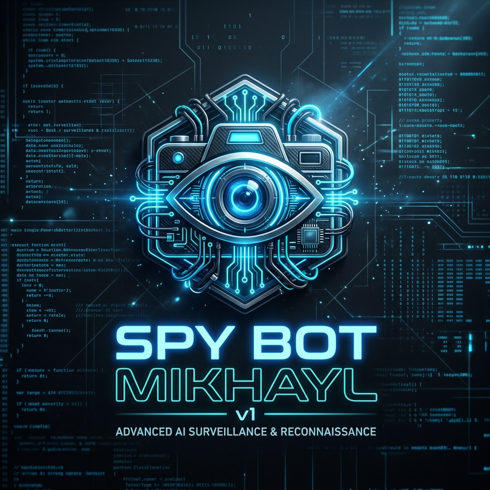

# 🌑 SPY BOT MIKHAYL V1
> ⚡ Advanced Automation • System Interaction • Python Engineering

<p align="center">
  
</p>

<p align="center">
  
  
  
  
  
</p>

---

## 🎥 Preview (Demo)

<p align="center">
  
</p>

> 💡 *Tambahkan file `demo.gif` ke repo kamu (record pakai OBS atau ScreenToGif biar makin keren)*

---

## 🧠 Tentang Project

**Spy Bot Mikhayl v1** adalah project eksplorasi Python yang fokus pada:

- ⚙️ Automation berbasis command
- 📡 Integrasi API (Telegram)
- 🧵 Multithreading system
- 🖥️ Interaksi langsung dengan OS (Windows)
- 🔄 Real-time command execution

Project ini menunjukkan bagaimana sebuah sistem bisa:
> menerima perintah → memproses → mengeksekusi → mengembalikan hasil secara real-time

---

## 🚀 Highlight Engineering

✨ Beberapa hal menarik secara teknis:

- 🔹 Dynamic Command Handler (real-time polling)
- 🔹 Multi-threaded background services
- 🔹 System-level interaction (process, file, device)
- 🔹 Audio & multimedia handling
- 🔹 Event-driven architecture

---

## 🧩 Tech Stack

```bash
Python 3.10+
Telegram Bot API
Windows API (via Python)
````

**Libraries utama:**

* `psutil`
* `pyautogui`
* `requests`
* `pynput`
* `opencv-python`
* `pyttsx3`

---

## 🧪 Learning Value

Project ini sangat cocok untuk belajar:

* 🧠 System scripting
* ⚙️ Automation logic
* 📡 API integration
* 🧵 Threading & concurrency
* 🖥️ OS interaction

---

## 📊 GitHub Stats

<p align="center">
  
  
</p>

---

## 🗂️ Struktur Project

```
📁 Spy-Bot-Mikhayl-v1
 ├── spy_bot.py
 ├── README.md
 ├── banner.png
 ├── demo.gif
 └── assets/
```

---

## ⚠️ DISCLAIMER

> 🚨 Project ini dibuat untuk:
>
> * Edukasi
> * Eksperimen pribadi
> * Pengujian di environment sendiri

❌ Dilarang digunakan untuk:

* Akses tanpa izin
* Aktivitas ilegal
* Penyalahgunaan sistem orang lain

---

## 👨‍💻 Developer

**Mikhayl**

<p align="center">
  <a href="https://github.com/Mikhayl-05">
    
  </a>
  <a href="https://instagram.com/mhmyl_">
    
  </a>
</p>

---

## ⭐ Final Notes

Kalau project ini menarik buat kamu:

* ⭐ Star repo ini
* 🍴 Fork & eksperimen
* 🚀 Jadikan inspirasi project kamu

---

<p align="center">
  ⚡ Built with passion, logic, and curiosity
</p>
